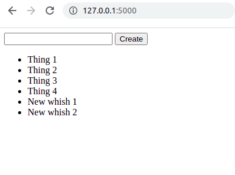

# wanted_list app repository

Author: Roberto Zegers R.  
Date: June 2021  
License: BSD-3-Clause  

## Description

Minimal Flask app using PostgreSQL via SQLAlchemy.  

## Usage

First you must connect to a <strong>PostgreSQL database cluster</strong>, for instance with the command <code style="background: black; color: white;">pg_ctl -D my_db_cluster start</code>. 

Then, you have to manually create the database <code>whishlistdb</code>, do it using the <code style="background: black; color: white;">createdb</code> command line tool installed with Postgres:
<pre style="background: black; color: white; overflow: hidden; white-space: break-spaces;padding: 6px;">createdb whishlistdb
</pre>

Optionally you can also create some database records using <code>psql</code>.  
Connect <code>psql</code> to the <strong>whishlistdb</strong> database:
<pre style="background: black; color: white; overflow: hidden; white-space: break-spaces;padding: 6px;">psql whishlistdb
</pre>

Now run the application using: 

 
<pre style="background: black; color: white; overflow: hidden; white-space: break-spaces;padding: 6px;">
$ python3 app.py
</pre> 

Enter the URL <code> http://127.0.0.1:5000/</code> on your browser to display the app. 

It will just show a blank page. 

On your terminal tab run <strong>psql</strong> and insert new records into the <strong>whishes</strong> table:
    
<pre style="background: black; color: white; overflow: hidden; white-space: break-spaces;padding: 6px;">    
whishlistdb=# INSERT INTO whishes (description) VALUES ('Thing 1');
INSERT 0 1
whishlistdb=# INSERT INTO whishes (description) VALUES ('Thing 2');
INSERT 0 1
whishlistdb=# INSERT INTO whishes (description) VALUES ('Thing 3');
INSERT 0 1
whishlistdb=# INSERT INTO whishes (description) VALUES ('Thing 4');
INSERT 0 1
whishlistdb=#
</pre>

Verify that the new database records got added: 
    
<pre style="background: black; color: white; overflow: hidden; white-space: break-spaces;padding: 6px;">whishlistdb=# SELECT * FROM whishes;
</pre>

Finally enter the URL <code> http://127.0.0.1:5000/</code>  on your browser and refresh is neccesary.  

Expected result: 

 
 

 
  

